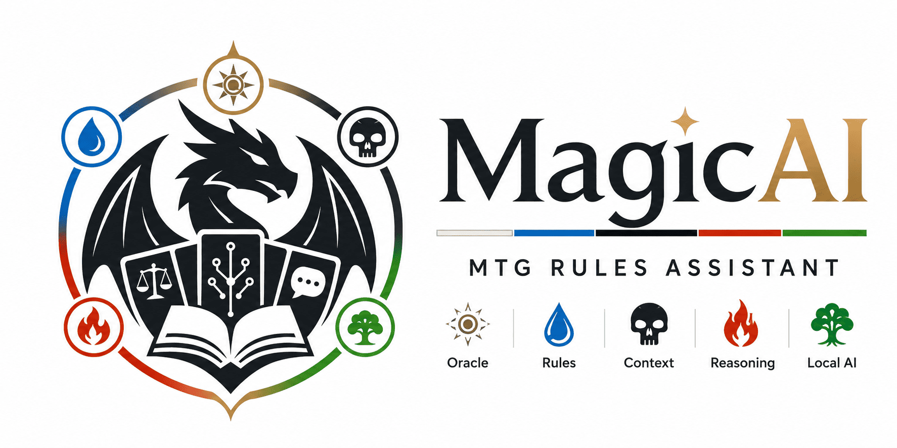

<div align="center">



# MagicAI

### More Gathering. Less Guessing.

**Asistente local y source-grounded para Magic: The Gathering**
**Local, source-grounded assistant for Magic: The Gathering**

`v0.1.0-alpha` · Judge core in active development · Local-first

> `main` contiene la versión estable o publicada. El desarrollo activo se integra en `develop` y cada sprint se trabaja en una rama `feature/*`.

</div>

---

## 🇪🇸 Qué es MagicAI

MagicAI es un proyecto de IA local especializado en **Magic: The Gathering**. Su primer producto es el **Juez**, un asistente que recupera Oracle, reglas y contexto antes de responder.

La idea central es sencilla:

> El modelo no es la fuente de verdad. El Juez recupera la evidencia y el modelo la explica.

MagicAI no intenta memorizar todas las cartas ni todas las reglas. Construye el contexto necesario para cada pregunta, aplica renderizadores deterministas cuando existe una respuesta formal conocida, valida las respuestas del LLM y utiliza fallbacks seguros cuando la evidencia no basta.

### Alcance actual

- Oracle y rulings locales descargados desde los bulk de Scryfall.
- Magic Comprehensive Rules locales.
- Recuperación de cartas, keywords, símbolos y reglas relacionadas.
- Memoria conversacional y resolución de referencias ambiguas.
- Renderizado determinista de familias de reglas cubiertas.
- Ollama como motor local para explicaciones no cubiertas por renderizadores.
- Validación, reintento y fallback source-grounded.
- API REST de desarrollo.
- UI beta local servida por FastAPI, sin Node ni servicios externos.
- Historial persistente de conversaciones en SQLite local, con apertura, renombrado y borrado desde la UI.
- Suites de regresión, generalización, Gauntlet dinámico y campañas multisemilla.
- Open Judge Gauntlet con contratos semánticos para conversaciones reales.

### Alcance de cartas

El Juez y las campañas estándar se centran en **cartas de papel ordinarias**. Se excluyen cartas de broma, silver-border, acorn y playtest, además de objetos suplementarios como Vanguard, tokens, emblemas, planos, fenómenos y esquemas. Las cartas ordinarias siguen siendo consultables aunque estén prohibidas actualmente.

### Estado

El Juez ya es funcional para varias familias de reglas y dispone de una UI beta local. El desarrollo inmediato se centra en mejorar usabilidad, persistencia y distribución, mientras la cobertura factual solo se amplía cuando aparecen fallos reales de prioridad suficiente.

La última campaña dinámica validada cubrió:

```text
3 semillas
126 escenarios
14 conceptos
42 plantillas
126 PASS
0 WARN
0 FAIL
```

La matriz completa de regresión actualmente validada es:

```text
Reddit Gauntlet          30/30
Generalization Probe     18/18
Dynamic Gauntlet         42/42
Dynamic Campaign        126/126
--------------------------------
Ejecuciones validadas   216/216
WARN                           0
FAIL                           0
```

Esta cifra describe una matriz controlada y reproducible sin regresiones. No significa que estén cubiertas todas las cartas, reglas o interacciones posibles de Magic.

Consulta [docs/STATUS.md](docs/STATUS.md) para el estado detallado y [docs/ROADMAP.md](docs/ROADMAP.md) para la hoja de ruta.

---

## 🇬🇧 What is MagicAI?

MagicAI is a local AI project specialized in **Magic: The Gathering**. Its first product is the **Judge**, an assistant that retrieves Oracle text, rules and conversation context before answering.

Its core principle is:

> The model is not the source of truth. The Judge retrieves evidence and the model explains it.

MagicAI does not try to memorize every card or rule. It builds the context required for each question, uses deterministic renderers where a formal answer is available, validates LLM output and falls back safely when evidence is insufficient.

The Judge and standard test catalog focus on ordinary paper cards. Funny, silver-border, acorn and playtest cards are out of scope, together with supplemental objects such as Vanguard cards, tokens, emblems, planes, phenomena and schemes.

See [docs/STATUS.md](docs/STATUS.md) for the current state and [docs/ROADMAP.md](docs/ROADMAP.md) for the development plan.

---

## Principios del proyecto · Project principles

- **Judge authority:** el Juez es la única autoridad factual sobre cartas, reglas, rulings y legalidad.
- **Retrieve, do not memorize:** Oracle y reglas antes que memoria del modelo.
- **No card-specific patches:** los arreglos deben ser genéricos, transparentes y reutilizables.
- **Local-first:** la inferencia se ejecuta mediante Ollama en la máquina del usuario.
- **Safe uncertainty:** es preferible declarar evidencia insuficiente a inventar una interacción.
- **Test the premise:** una respuesta correcta no sirve si la pregunta se generó desde una premisa falsa.
- **Official-play scope:** no se gastan recursos estándar en cartas de broma o playtest.

Más detalle en [docs/PHILOSOPHY.md](docs/PHILOSOPHY.md).

---

## Arquitectura resumida · Architecture overview

```text
User / API
    │
    ▼
Conversation + disambiguation
    │
    ▼
Context Builder
    │
    ├── card extraction
    ├── keyword and action detection
    └── rule-query generation
    │
    ▼
Context Enricher
    │
    ├── local Oracle
    ├── local Scryfall rulings
    ├── Comprehensive Rules
    └── Scryfall symbology
    │
    ▼
Knowledge Builder
    │
    ▼
Deterministic rule renderer
    │
    ├── answer found ───────────────► final answer
    │
    └── no deterministic answer
             │
             ▼
          Ollama
             │
             ▼
     validation → retry → safe fallback
```

La arquitectura completa y la separación futura entre Juez, Deck Master y Deckbuilder se documentan en [docs/ARCHITECTURE.md](docs/ARCHITECTURE.md).

---

## Requisitos · Requirements

- Python **3.12+**
- Ollama accesible por HTTP
- Modelo recomendado: **Qwen3 8B**
- `curl`, `wget` y `jq` para los scripts de descarga
- Linux, WSL2 o un entorno equivalente

La configuración por defecto espera:

```text
OLLAMA_URL=http://127.0.0.1:11434/api/chat
MAGICAI_MODEL=qwen3:8b
```

Ambas variables pueden sobrescribirse mediante el entorno.

---

## Instalación rápida · Quick start

La guía lineal completa, incluida la diferencia entre `main` y `develop`, Ollama local, Docker o LAN y comprobaciones de salud, está en [docs/QUICKSTART.md](docs/QUICKSTART.md).

```bash
git clone https://github.com/Fartis/MagicAI.git
cd MagicAI

python3.12 -m venv .venv
source .venv/bin/activate

python -m pip install --upgrade pip
python -m pip install -r requirements.txt
```

`requirements.txt` instala el proyecto en modo editable mediante `-e .`. Las dependencias directas se declaran en `pyproject.toml`.

Para reproducir exactamente el entorno validado:

```bash
python -m pip install -r requirements.txt   -c requirements.lock.txt
python -m pip check
```

Descarga las fuentes locales:

```bash
./scripts/download_sources.sh
./scripts/download_rules.sh
python scripts/update_scryfall_symbology.py
```

Comprueba Ollama y descarga el modelo:

```bash
ollama list
ollama pull qwen3:8b
```

Si Ollama se ejecuta en Docker:

```bash
docker exec ollama ollama list
docker exec ollama ollama pull qwen3:8b
```

---

## API de desarrollo · Development API

```bash
python -m uvicorn magicai.api:app --reload
```

Endpoints útiles:

```text
UI   http://127.0.0.1:8000/ui
GET  http://127.0.0.1:8000/
POST http://127.0.0.1:8000/ask
DOCS http://127.0.0.1:8000/docs
```

La UI beta muestra la conversación, el estado de `JudgeResult`, cartas, reglas, rulings, supuestos, advertencias y salud de las fuentes. También permite seleccionar candidatos de desambiguación, copiar o exportar evidencia y gestionar un historial persistente de conversaciones guardado localmente en SQLite. Consulta [docs/UI.md](docs/UI.md).

Ejemplo:

```bash
curl -X POST http://127.0.0.1:8000/ask \
  -H 'Content-Type: application/json' \
  -d '{"question":"¿Puedo responder a Ward?"}'
```

La API mantiene `answer` y `session_id` por compatibilidad, pero ya devuelve un `JudgeResult` estructurado con estado, origen, confianza, autoridad, cartas, reglas, consultas de recuperación, advertencias y versiones locales de fuentes.

El contrato HTTP está versionado y preparado para la UI beta:

```text
GET  /meta    versiones y valores admitidos por el contrato
GET  /health  disponibilidad de fuentes locales y Ollama
POST /ask     JudgeResult estructurado y compatible con clientes legacy
```

Los errores HTTP utilizan un sobre estructurado y versionado. Consulta [docs/API_CONTRACT.md](docs/API_CONTRACT.md).

Ejemplo abreviado:

```json
{
  "answer": "No puedes responder durante la resolución.",
  "session_id": "...",
  "status": "answered",
  "origin": "deterministic_rule",
  "confidence": "high",
  "authority": "judge",
  "cards": [],
  "rules": [{"number": "117.2e", "title": "..."}],
  "assumptions": [],
  "warnings": [],
  "source_versions": {
    "comprehensive_rules": "2026-06-19"
  }
}
```

Consulta [docs/JUDGE_RESULT.md](docs/JUDGE_RESULT.md) para el contrato completo.

---

## Pruebas · Testing

Pruebas rápidas sin campaña completa:

```bash
PYTHONPATH=. python -m tests.quality.dynamic_gauntlet_generator_test
PYTHONPATH=. python -m tests.quality.dynamic_campaign_planner_test
PYTHONPATH=. python -m tests.quality.dynamic_concept_contract_test
PYTHONPATH=. python -m tests.retrieval.rule_queries_test
PYTHONPATH=. python -m tests.retrieval.conversation_continuity_test
PYTHONPATH=. python -m tests.validation.rule_renderer_test
PYTHONPATH=. python -m tests.validation.oracle_renderer_test
PYTHONPATH=. python -m tests.validation.strategy_boundary_test
PYTHONPATH=. python -m tests.validation.judge_result_test
PYTHONPATH=. python -m tests.api.judge_result_schema_test
PYTHONPATH=. python -m tests.quality.open_judge_contract_test
PYTHONPATH=. python -m tests.quality.open_judge_evaluator_test
PYTHONPATH=. python -m tests.quality.open_judge_reports_test
```

Open Judge Gauntlet:

```bash
PYTHONPATH=. python -m tests.quality.open_judge_test
```

Genera una baseline semántica de 11 conversaciones y 27 turnos, con informes TXT, JSON, XML y HTML.

Gauntlet dinámico reproducible:

```bash
python -m tests.quality.dynamic_gauntlet_test \
  --seed 184729 \
  --cases 42
```

Campaña multisemilla:

```bash
python -m tests.quality.dynamic_campaign_test \
  --seed 184729 \
  --seed 987654 \
  --seed 424242 \
  --cases 42 \
  --require-full-coverage \
  --fail-on-warn
```

Consulta [docs/COMMANDS.md](docs/COMMANDS.md) para la referencia completa.

---

## Estructura principal · Main structure

```text
MagicAI/
├── magicai/
│   ├── api/               # REST API
│   ├── assistant/         # Judge orchestration
│   ├── conversation/      # sessions and disambiguation
│   ├── extractors/        # cards, keywords and rules
│   ├── llm/               # Ollama client
│   ├── reasoning/         # semantic action hints
│   ├── repositories/      # card/rule access boundary
│   ├── retrieval/         # rule and Oracle query building
│   ├── services/          # local search services
│   ├── sources/           # symbology access
│   └── validation/        # renderers, validation and fallback
├── tests/
│   ├── api/
│   ├── quality/
│   ├── regression/
│   ├── retrieval/
│   └── validation/
├── docs/
├── scripts/
├── sources/
└── database/
```

---

## Evolución prevista · Planned evolution

1. Validar la persistencia real y el nuevo historial gestionable de la UI beta.
2. Continuar el pulido visual y la experiencia móvil a partir de uso real.
3. Añadir preferencias de usuario y mejorar la experiencia móvil.
4. Ampliar cobertura del Juez únicamente según fallos reales de prioridad suficiente.
5. Preparar instalación y distribución reproducibles.
6. Añadir Deck Master y Deckbuilder sobre la misma UI, respetando la autoridad factual del Juez.

Deck Master y Deckbuilder **no tendrán acceso factual directo a Internet, Oracle ni reglas**. Para cartas, legalidad, rulings e interacciones deberán consultar al Juez mediante su API interna.

---

## Documentación

- [Arquitectura](docs/ARCHITECTURE.md)
- [Quickstart](docs/QUICKSTART.md)
- [Comandos](docs/COMMANDS.md)
- [UI beta](docs/UI.md)
- [Estado actual](docs/STATUS.md)
- [Contrato JudgeResult](docs/JUDGE_RESULT.md)
- [Contrato HTTP y compatibilidad](docs/API_CONTRACT.md)
- [Hoja de ruta](docs/ROADMAP.md)
- [Filosofía](docs/PHILOSOPHY.md)
- [Contribuir](docs/CONTRIBUTING.md)

---

## Licencia

El código de MagicAI se distribuye bajo la **GNU Affero General Public License v3.0 o posterior** (`AGPL-3.0-or-later`).

Puedes usarlo, estudiarlo, modificarlo y redistribuirlo bajo los términos de esa licencia. Si publicas o prestas por red una versión modificada de MagicAI, debes ofrecer a quienes interactúen con ella acceso al código fuente correspondiente de esa versión.

Consulta [LICENSE](LICENSE) y [docs/LICENSING.md](docs/LICENSING.md).

